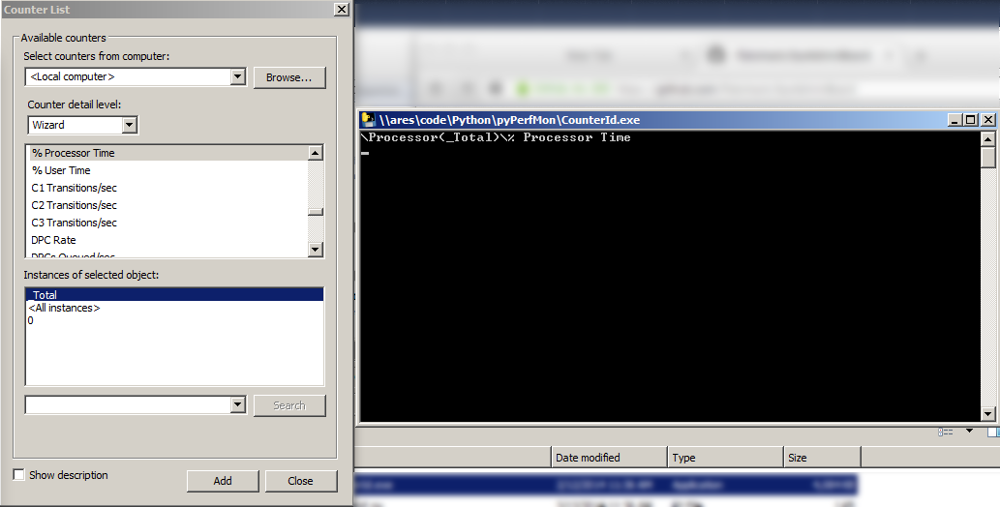

pyPerfMon
=======================

pyPerfMon is a simple windows web service that will expose perfmon counters as JSON data.  It is designed to be used with my [SysAdminBoard](https://github.com/flakshack/SysAdminBoard) program.

##Features
###pyPerfMon

This is a Windows program that will launch a mini CherryPy Webserver to expose data from the Windows Performance Monitor.  The program is configured via the PYPERFMON.INI file.
```
# This is the config file for pyperfmon.exe
# Specify any perfmon counters you want to expose via the webservice below using the format:
#     name_you_make_up = \Path of the\Counter
# For help identifying the name of the counters, run CounterID.exe and click Add on any 
# counter. The path will appear in the console output.
#
# Replace any % symbol with two %%

[counters]
available_mbytes = \Memory\Available MBytes
processor_c1_per_sec=\Processor(_Total)\C1 Transitions/sec
memory_cache_faults_per_sec=\Memory\Cache Faults/sec
processor_percent_idle=\Processor(_Total)\%% Idle Time

[webserver]
listen_address = 0.0.0.0
listen_port = 8001
```

Data is returned in JSON format for easy consumption by my SysAdminBoard program. Note that it is not storing historical data, but just returning the current value of the perfmon counter.  To test it, just use the "test = \Memory\Available MBytes" counter (which is available on all Windows computers), then browse to the IP and port in your web browser.  For example, as configured in the INI file above, if I browse to http://myserver.mydomain.local:8001 it returns:
```
{"available_mbytes": 6424.0, "processor_c1_per_sec": 799.5292814619963, "memory_cache_faults_per_sec": 1919.7266176328415, "processor_percent_idle": 87.23507194915213}
```

Note that if you wanted to use this service to return data directly to one of the StatusBoard's built-in graphing functions, it would be trivial to modify the code to store 30 minutes or so of data.


###CounterId


This program will help you identify counter names so you can add them to the PYPERMON.INI file.  When you click on the ADD button, it will output the counter's name to a console window.  You can then copy this name to the PYPERFMON.INI file.

##Links to Projects used here
* [pyinstaller](http://www.pyinstaller.org/) - Used to compile python to EXE
* [pywin32](https://github.com/mhammond/pywin32/releases) - Installer for win32 API access via python
* [win32pdh](http://www.cac.cornell.edu/wiki/index.php?title=Performance_Data_Helper_in_Python_with_win32pdh) - Python module to access perfmon data
* [CherryPy](http://www.cherrypy.org/) - Webserver
